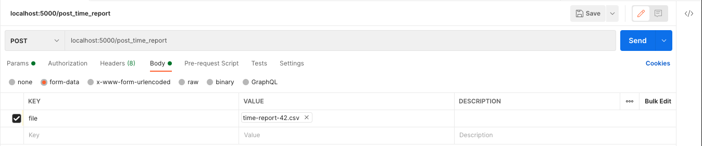

### Project Structure
```
│─── README.md            # Challenge specific README
│─── .gitignore
│─── Pipfile
│─── Pipfile.lock
│─── .env.example         # Environment variables for configs
│─── config.py
│─── test_routes.py       # Unit tests for endpoints
│─── time-report-42.csv   # Mock csv data used by unit tests
└─── flask_app
    |─── models.py        # Data models
    |─── routes.py        # API endpoints
    |─── utils.py         # Helper utilities
    |─── README.md        # Project specific README
    └─── __init__.py      # FLASK_APP entry point
```
### Configuration
Committing `.env` file is omitted, environment variables can be found in `.env.example`, please make sure to remove .example extension before configuring the environment. Once its renamed to `.env` then you may follow the steps described in How to run.
`config.py` handles different types of configrations, i.e `ProductionConfig`, `DevelopmentConfig` for easy setup
betweeen dev and production/qa/staging machines.

### How to run
```bash
# Assuming Pipenv is installed on the host machine
# Setup virtual env and install packages
$ pipenv shell
$ pipenv install
# Dev packages are needed for testing
$ pipenv install --dev

# Assuming Docker is installed on the host machine
# Start Postgres Docker container
$ docker-compose up

# Start backend server
$ cd flask_app && flask run

# To upload csvs
# Either postman or cURL can be used
# key should be set as "file", with both methods, as the endpoint won't be able to find the file otherwise
$ curl -F file=@time-report-42.csv localhost:5000/post_time_report
```

### How to test
There are 3 unit tests - 1 parametrized, adding upto 10 items total. They can be run by `pytest test_routes.py`. 
**Reminder:**
*As the tests are using the example csv in the repo, the filename will be in use in the db after the first test run, my suggestion is to run the tests after manual testing and tearing down the db and redis and re-starting the backend server. If not, the failure of the first test case is expected. This can be avoided by creating mock csv fixtures with different report_ids, [factory_boy](https://factoryboy.readthedocs.io/en/stable/) is useful for this purpose. As per time constraints, this is neglected.*
### How to postman


### Design notes
I've created a single table for this implementation, it has pros and cons. There is very small chance of spontaneous csv upload with the same report_id that might break the no duplicate report_id rule but this can avoided with a task queue in production env. Although there is a validation on single hours worked entry yet the table does allow multiple entries for the same, this comes brings flexibility to add backdated timesheets but also requires application level validation to make sure total hours worked is reasonable e.g not 25h a day. Also job_group is defined as `Enum` this limits the input, any other job group provided in a csv will cause issue, this might be extended by adding a new job group to JobGroup class but it's not automated.

### Notes
In addition to what was asked, the GET endpoint is also able to handle `employee_id`, `start_time` and `end_time` as query params to filter out results, if not provided it will fallback to default behavior. `http://localhost:5000/get_payroll_report?start_date=14/11/2016&end_date=26/12/2016&employee_id=1`, will fetch the results between (start_date, end_date) for employee_id = 1.

### Q&A
- How did you test that your implementation was correct?
    - Unit tests are testing the basic functionality of the implementation. In addition to this, I've tested the application through manual end-to-end testing i.e uploading csv and getting payroll reports for different employee_id, start_date, end_date combinations.
- If this application was destined for a production environment, what would you add or change? I would:
    - Configure Nginx as a web server and reverse proxy, for security and scalability reasons.
    - Consider adding an authentication layer, [Flask-Security](https://pythonhosted.org/Flask-Security/) can provide both session and token based authentication.
    - Add validation for every input related assumption given in the description, type checks, corrupted data checks etc. [Marshmallow](https://flask-marshmallow.readthedocs.io/en/latest/) is worth looking at for this purpose.
- What compromises did you have to make as a result of the time constraints of this challenge?
Given more time I would;
    - Increase the test coverage, add edge cases to ensure implementation correctness
    - Implement business limitations i.e time-off, statutory holidays, limiting hours worked to N-hours per day
    - Create cron jobs to compute and fill the cache, avoiding spikes at usage. [Celery](https://docs.celeryproject.org/en/stable/) would be a good idea or even [Huey](https://huey.readthedocs.io/en/latest/).
    - Discover better caching solutions, i.e cache by employee_id and set a TTL for cached objects.
    - Enable different data formats as input e.g json
    - It is very likely that I'd need database changes at some point, I'd configure [Alembic](https://flask-alembic.readthedocs.io/en/stable/#) to update schemas,track migrations and add Block Range INdex on date
    - Built a [ReactJS](https://reactjs.org/) frontend web app, to upload csv and visualize payroll information